# Harmonize: AI-Powered Audio Processing Suite

<br> <p align="center"> 


</p>

## 📖 **Table of Contents**

1. [🎵 Overview](#overview)
2. [🌟 Key Features](#key-features)
    - [Audio Separation](#1-audio-separation)
    - [Audio to MIDI Conversion](#2-audio-to-midi-conversion)
    - [Modify MIDI Files](#3-modify-midi-files)
    - [Lyrics Extraction and Translation](#4-lyrics-extraction-and-translation)
    - [Karaoke Video Generation](#5-karaoke-video-generation)
3. [🎸 Research on Guitar Notes](#research-on-guitar-notes)
    - [Key Steps in the Research](#key-steps-in-the-research)
    - [Visualizations and Results](#visualizations-and-results)
    - [Why This Research Matters](#why-this-research-matters)
4. [🖥️ How to Use the App](#how-to-use-the-app)
    - [Audio Separation](#audio-separation)
    - [Audio to MIDI Conversion](#audio-to-midi-conversion)
    - [Modify MIDI Files](#modify-midi-files)
    - [Lyrics Extraction and Translation](#lyrics-extraction-and-translation)
    - [Karaoke Video Generation](#karaoke-video-generation)
5. [🗂️ Project Structure](#project-structure)
6. [📦 Installation Guide](#installation-guide)
7. [📊 Technical Highlights](#technical-highlights)
8. [🔧 Troubleshooting](#troubleshooting)
9. [🚀 Future Enhancements](#future-enhancements)
10. [👨‍💻 Team](#team)
11. [📜 License](#license)


---

<a id="overview"></a>
## 🎵 **Overview**
This application provides musicians, producers, and enthusiasts with a powerful yet intuitive interface for audio processing. Using advanced models like Demucs, Basic Pitch, and Whisper, the app offers:

- **Audio Separation**: Extract instrumental and vocal stems.
- **MIDI Conversion**: Convert instrumental audio to editable MIDI files.
- **MIDI Modification**: Customize MIDI files using AI-powered prompts.
- **Lyrics Extraction and Translation**: Extract lyrics from songs and translate them into multiple languages.
- **Karaoke Video Generation**: Create karaoke videos with synchronized lyrics and a custom background.

---

<a id="key-features"></a>
## 🌟 **Key Features**

### 1. Audio Separation
- **Description**: Extract individual components (e.g., vocals, bass, drums).
- **Model Used**: [Demucs](https://github.com/facebookresearch/demucs).
- **Use Case**: Isolate instrumental tracks for practice or remixing.

### 2. Audio to MIDI Conversion
- **Description**: Convert audio into MIDI format for further editing.
- **Model Used**: [Basic Pitch](https://github.com/spotify/basic-pitch).
- **Use Case**: Generate sheet music or integrate into DAWs.

### 3. Modify MIDI Files
- **Description**: Apply transformations like changing the scale or style using AI-generated prompts.
- **Model Used**: Google Gemini API.
- **Use Case**: Create unique renditions of existing tracks.

### 4. Lyrics Extraction and Translation
- **Description**: Extract and translate lyrics from vocal tracks.
- **Model Used**: [Whisper](https://openai.com/whisper).
- **Use Case**: Understand or re-purpose song lyrics.

### 5. Karaoke Video Generation
- **Description**: Create karaoke videos with synchronized lyrics and custom backgrounds.
- **Tools Used**: FFmpeg for video processing.
- **Use Case**: Host karaoke sessions or share lyric videos online.
---

<a id="research-on-guitar-notes"></a>
## 🎸 **Research on Guitar Notes**

Before developing the comprehensive audio processing app, we conducted focused research on recognizing guitar notes using machine learning and signal processing. This foundational work guided our understanding of audio features and model capabilities.

### Key Steps in the Research:

1. **Feature Extraction for Audio**  
   - **MFCC (Mel-Frequency Cepstral Coefficients)**: Captures the spectral envelope of audio signals.  
   - **Mel Spectrogram**: Provides a frequency-based visual representation.  
   - **Chroma Features**: Highlights harmonic pitch content.  
   - **Spectral Contrast**: Differentiates between peaks and valleys in the spectrum.

2. **Model Training**  
   - Used **Convolutional Neural Networks (CNNs)** with TensorFlow/Keras to classify guitar chords.  
   - Trained on diverse datasets of `.wav` files containing guitar notes at varying pitches, tones, and durations.  
   - Achieved high validation accuracy: **98.5%**.

3. **Pitch Estimation and Signal Processing**  
   - Applied FFT (Fast Fourier Transform) and CQT (Constant-Q Transform) for frequency analysis.  
   - Estimated fundamental frequencies and converted them into MIDI notes.  
   - Segmented audio into smaller chunks for chord prediction.

4. **Data Augmentation**  
   - Applied techniques such as white noise addition, time stretching, and pitch shifting to improve model robustness.

5. **Outputs**  
   - Visualized predictions with **CQT** and **FFT** to validate chord recognition accuracy.  
   - Generated MIDI files for the predicted notes.  
   - Created **music21 streams** and MIDI files for playback and analysis.  
   - Example Output: `sweet_child_music21_with_chords.mid`.

6. **Interactive UI for Fine-Tuning**  
   - Implemented sliders to adjust CQT parameters for better flexibility and analysis.

---

### Visualizations and Results:

- **Feature Extraction Outputs**:  
   - MFCC visualization.  
   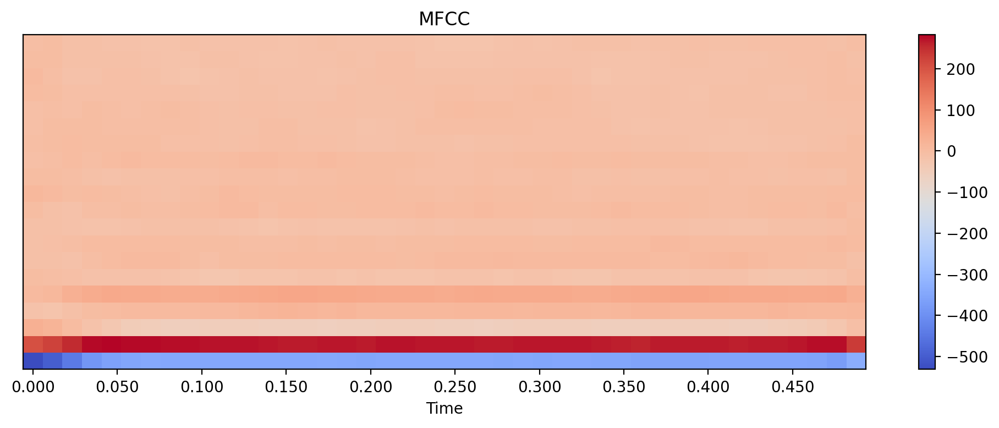

   - Mel Spectrogram comparison (before/after training).  
   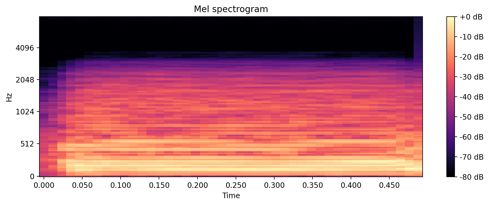

   - Chroma features with labels of pitch classes.
   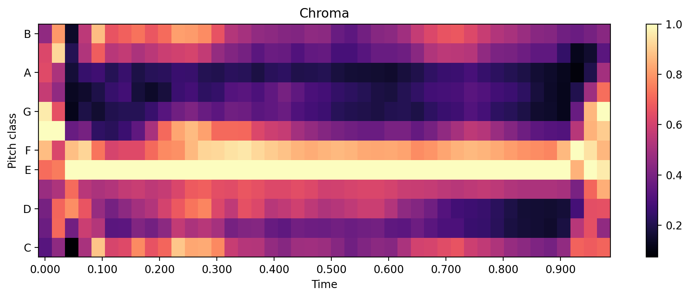

- **Model Training Evaluation**:  
  - Validation loss and accuracy graphs over training epochs.  
  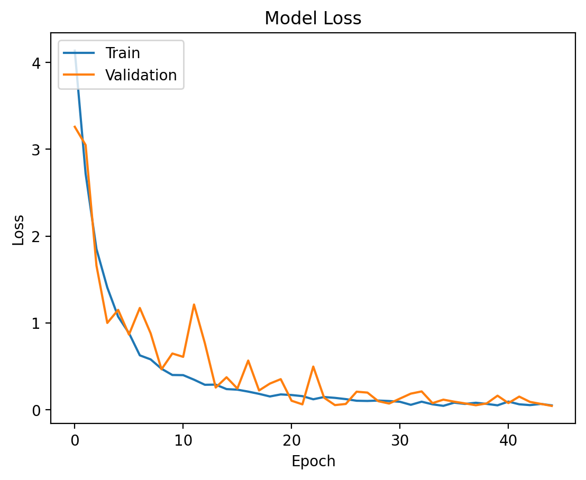

- **Audio Processing Visuals**:  
  - Raw audio waveform.  
  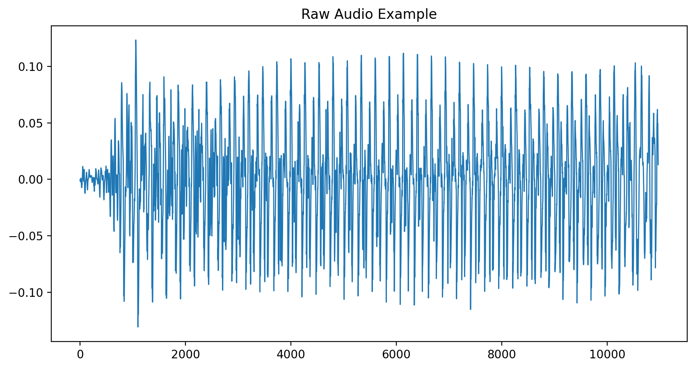

  - FFT and CQT plots.  
  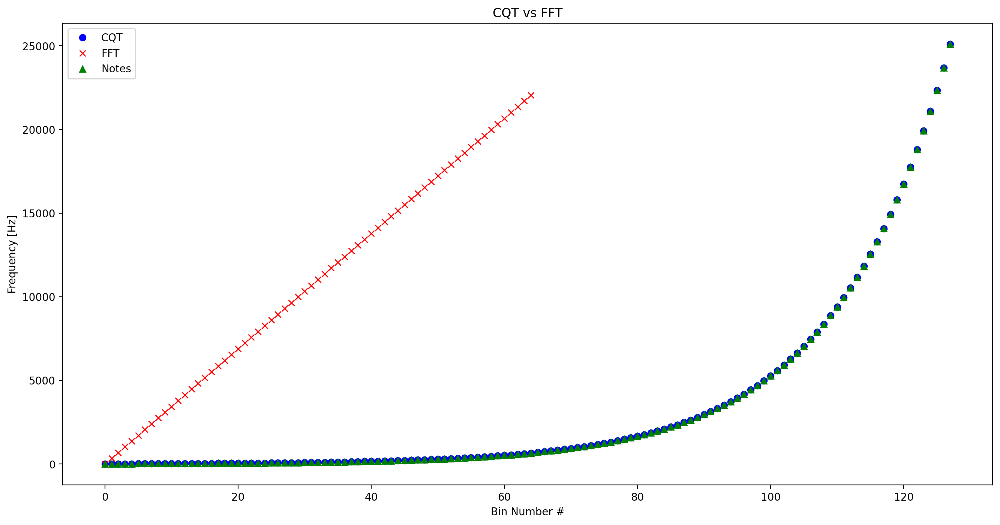

  - Predicted guitar notes.
  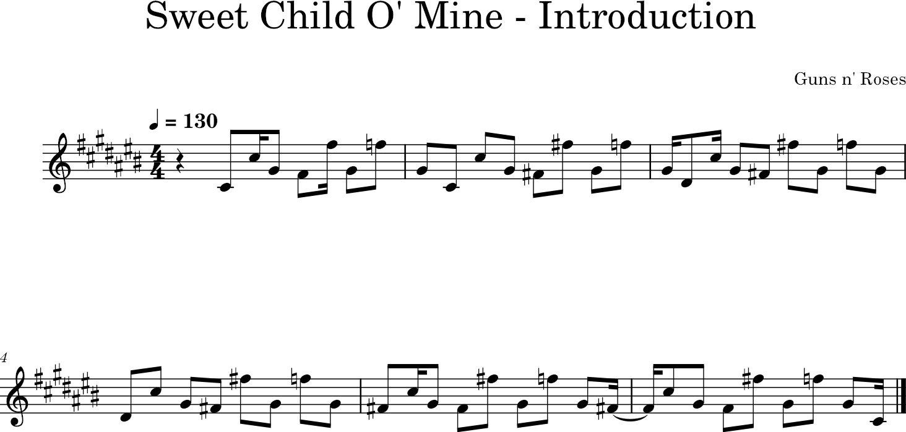

---

### Why This Research Matters:
This research proved instrumental in identifying the strengths and limitations of CNNs for specific instruments. It informed our decision to later leverage pre-trained models like **Demucs** and **Basic Pitch** for broader functionality.

---

<a id="how-to-use-the-app"></a>
## 🖥️ **How to Use the App**

### Step-by-Step Instructions:

#### **Audio Separation**
1. Run `python app.py` on the root directory. Open gradio on the browswer
2. Go to the "Audio Separation" tab.
3. Upload an audio file.
4. Customize parameters (e.g., model version, bitrate).
5. Click **Separate Audio** and download the stems.

> 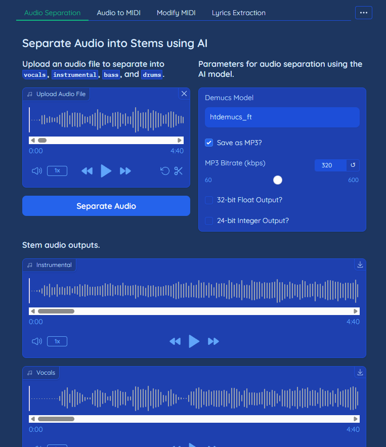

#### **Audio to MIDI Conversion**
1. Switch to the "Audio to MIDI" tab.
2. Upload an instrumental audio file.
3. Adjust MIDI generation settings (e.g., note threshold).
4. Click **Convert to MIDI** to generate and download the file.

> 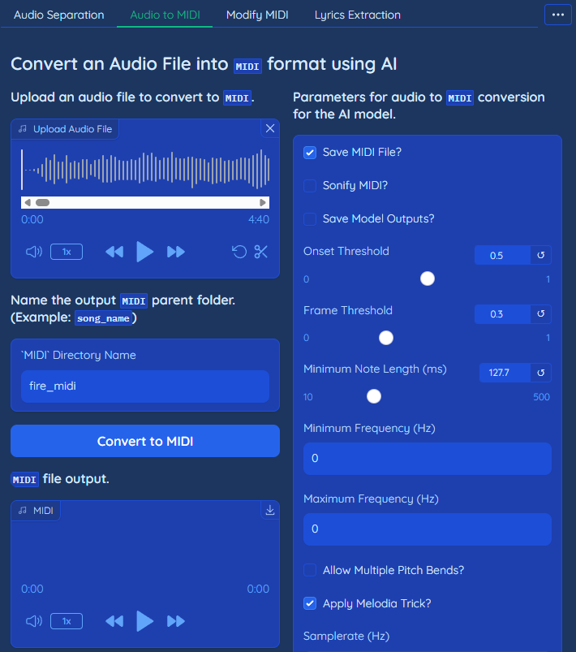

#### **Modify MIDI Files**
1. Select the "Modify MIDI" tab.
2. Upload a MIDI file.
3. Enter a text prompt (e.g., "Change to jazz style").
4. Click **Modify MIDI** to apply changes.

> 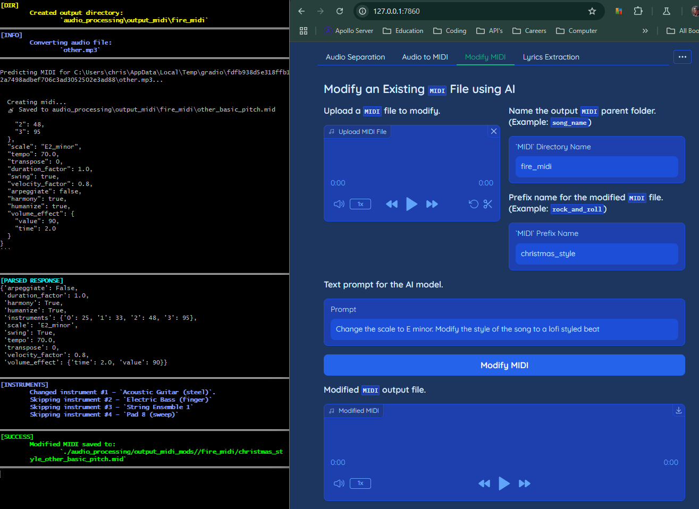

#### **Lyrics Extraction and Translation**
1. Go to the "Lyrics Extraction" tab.
2. Upload a vocal stem.
3. Click **Extract Lyrics** to display text.
4. Input a language code for translation (e.g., `en`, `es`, `fr`) and click **Translate**.

> 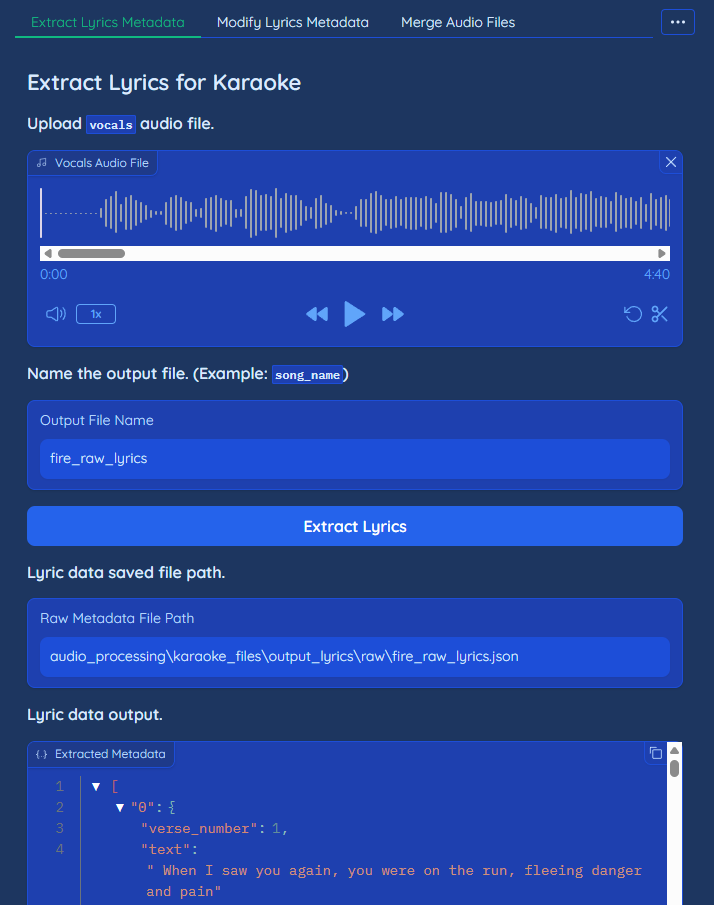

#### **Karaoke Video Generation**
1. Upload instrumental and vocal stems.
2. Use Whisper to synchronize lyrics.
3. Customize lyrics and background image.
4. Generate a karaoke video using FFmpeg.

> 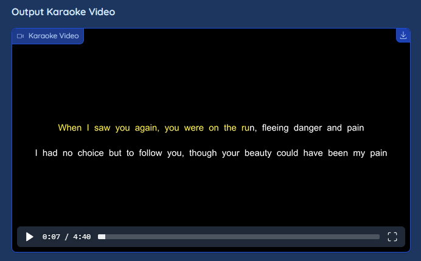

---

<a id="project-structure"></a>
## 📂 **Project Structure**

```plaintext
audio_processing_app/
├── output_stems/        # Processed audio stems
├── output_midi/         # Generated MIDI files
├── karaoke_videos/      # Karaoke video outputs
├── notebooks/           # Development notebooks
├── utilities/           # Helper scripts
│   ├── separate_audio.py
│   ├── audio_to_midi.py
│   ├── modify_midi.py
│   ├── lyrics_processing.py
├── app.py               # Main Gradio application
├── requirements.txt     # Python dependencies
```

<a id="installation-guide"></a>
## 📦 **Installation Guide**

### Pre-Installation Steps
Before installing the required dependencies, make sure to install the correct versions of PyTorch, torchvision, and torchaudio based on your system and CUDA version. Follow the instructions below:

---

1. **Clone the Repository**
   ```bash
   git clone https://github.com/Corey-Holton/Group_3_Project.git
   cd Group_3_Project
   ```

2. **Set Up Conda Environment**
   ```bash
   conda create -n audio_processing python=3.10 -y
   conda activate audio_processing
   ```

3. **Install Dependencies**  
   - First install `torch`, `torchvision`, `torchaudio`  
      - **For GPU Users:**
         - Install the appropriate CUDA toolkit.
         - Use the PyTorch installation guide to install the correct versions:
           ```bash
           pip install torch torchvision torchaudio --index-url https://download.pytorch.org/whl/cuXX
           ```
           Replace `cuXX` with your specific CUDA version (e.g., `cu118` for CUDA 11.8).

      - **For CPU Users:**
         - Install the CPU versions of PyTorch, torchvision, and torchaudio:
           ```bash
           pip install torch torchvision torchaudio --index-url https://download.pytorch.org/whl/cpu
           ```

      - **For macOS Users:**
         - Use the CPU-only version of PyTorch as macOS does not support CUDA:
           ```bash
           pip install torch torchvision torchaudio
           ```
   - Second install `requirements.txt`
      ```bash
      pip install -r requirements.txt
      ```

4. **Run the Application**
   ```bash
   python app.py
   ```

---

<a id="technical-highlights"></a>
## 📊 **Technical Highlights**

### Models and Techniques
- **Demucs**: Audio stem separation.
- **Basic Pitch**: Audio-to-MIDI conversion.
- **Whisper**: Lyrics extraction and translation.
- **Google Gemini API**: AI-based MIDI modification.

### Key Audio Features:
- **MFCC**: Mel-Frequency Cepstral Coefficients.
- **Chroma Features**: Harmonic pitch representation.
- **Spectral Contrast**: Timbre differentiation.
- **Mel Spectrogram**: Frequency-based signal representation.

### Data Augmentation:
- White noise addition.
- Time stretching/shifting.
- Pitch shifting.

> 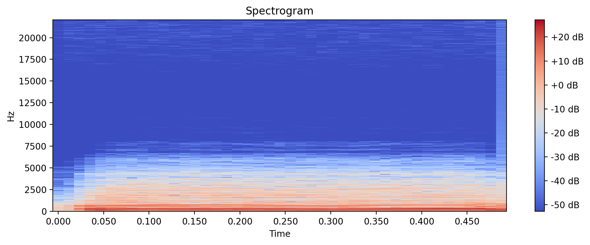

---

<a id="troubleshooting"></a>
## 🔧 **Troubleshooting**

- **Dependency Issues**: Ensure all libraries in `requirements.txt` are installed.
- **Missing Outputs**: Verify write permissions for `output_stems/` and `output_midi/`.
- **Model Compatibility**: Use Python 3.10+ for TensorFlow compatibility.

---

<a id="future-enhancements"></a>
## 🚀 **Future Enhancements**

1. Expand model compatibility for non-guitar instruments.
2. Real-time audio processing.
3. Cloud storage integration for outputs.
4. Enhanced lyrics editing features.

---

<a id="team"></a>
## 👩‍💻 **Team**
- Corey Holton
- Christian Palacios
- Edwin Lovera
- Montre Davis

---

<a id="license"></a>
## 📜 **License**
This project is licensed under the **MIT License**.

---